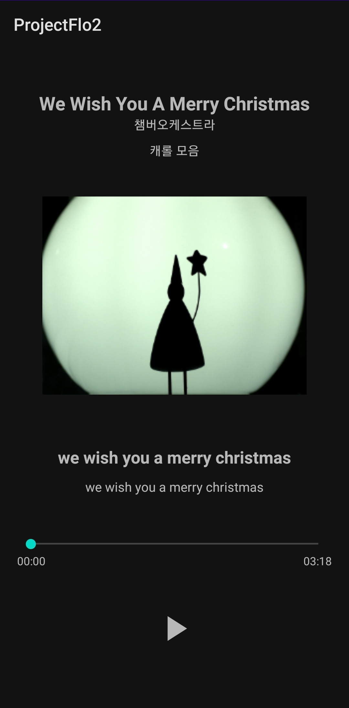
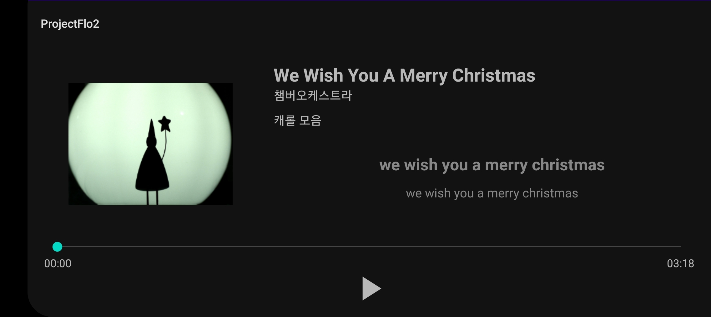
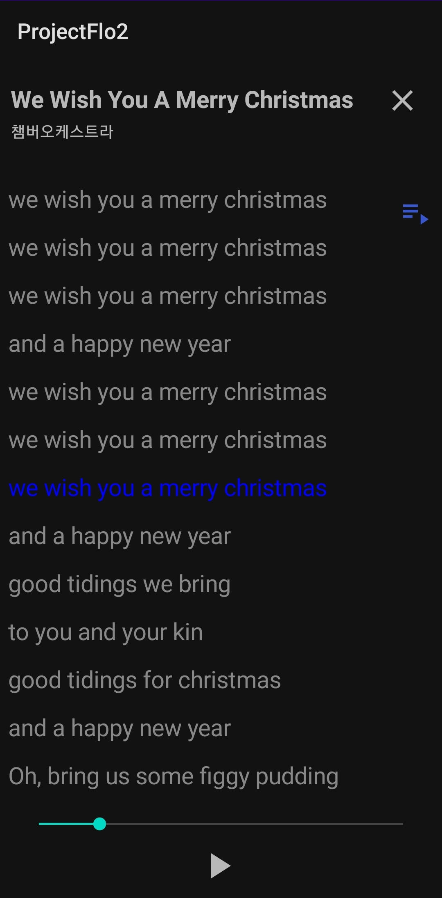
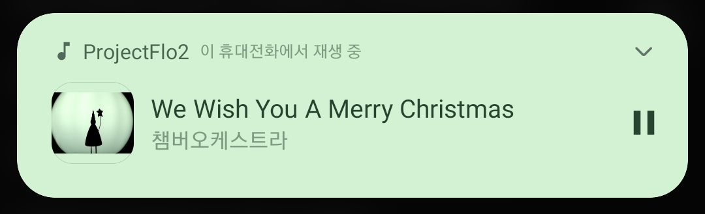

# ProjectFlo2 - Android App

## 동기
- https://programmers.co.kr/skill_check_assignments/3 에서 나온 프로젝트를 실제로 이행

## 기능
### Splash 구현
- 2초간 Flo 소개 사진을 띄우기
- 이 순간 Back 버튼 무력화시켜 handler 오류가 일어나지 않게 처리

### MainActivity

- Play 버튼을 누를 시 Service 및 Notification 활성화
- 노래가 나올 때마다 위치에 맞게 가사 업데이트
- 노래가 play 중이면 Coroutine 이용해서 seekbar 업데이트 Thread 활성화

- 가로모드 구현

### LyricsActivity

- 전체 가사 확인 가능
- 노래 나오는 부분을 파란색으로 표시
- 오른쪽 Toggle 버튼을 통해 모드 변경 가능
  + Toggle 모드: 가사를 클릭하면 그 가사로 노래가 이동
  + 아닐 시: 가사 클릭하면 finish
- MainActivity와 같이 노래가 play 중이면 Coroutine 이용해서 seekbar 업데이트 Thread 활성화
- 가로모드 구현

### MediaPlayerService

- Service 부분 담당
- Notification을 플레이 상황에 맞게 띄워줌
- MediaPlayer 위치
